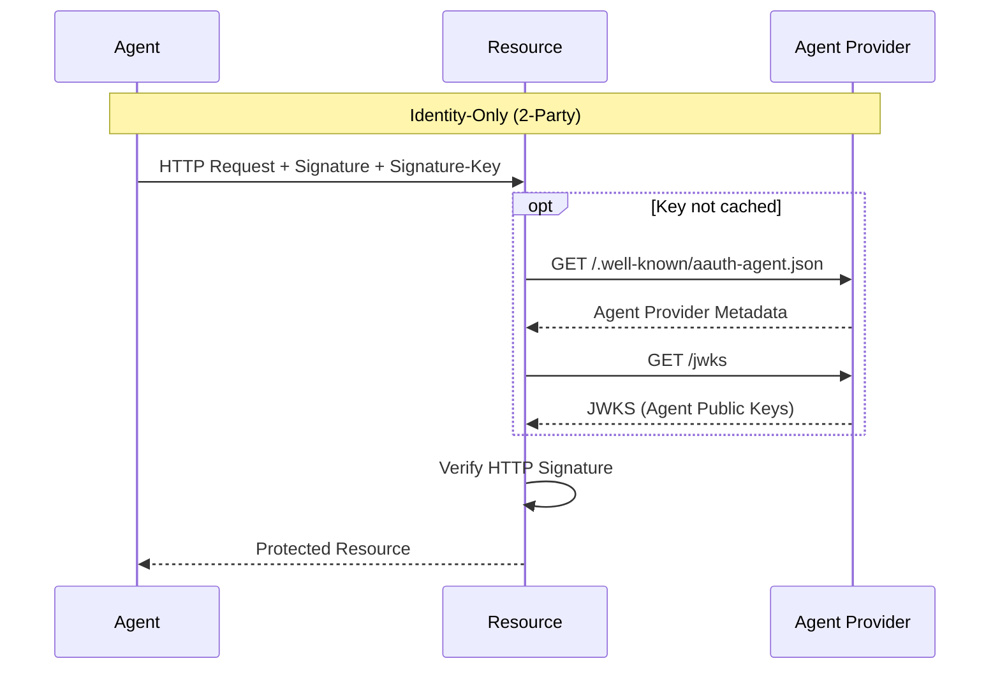
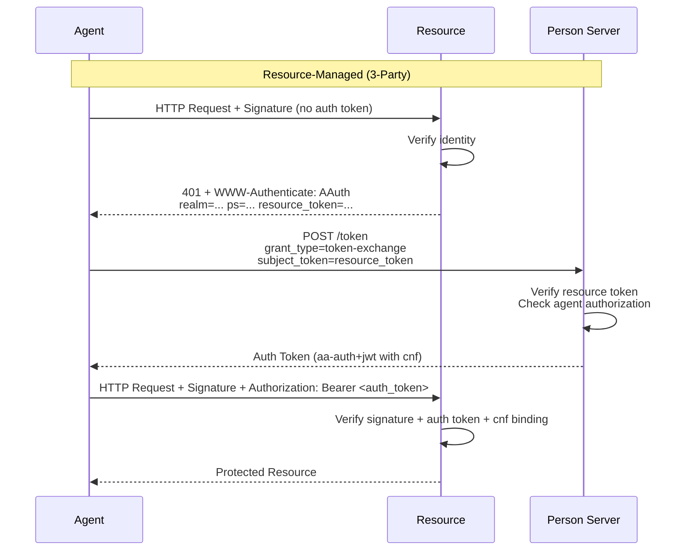
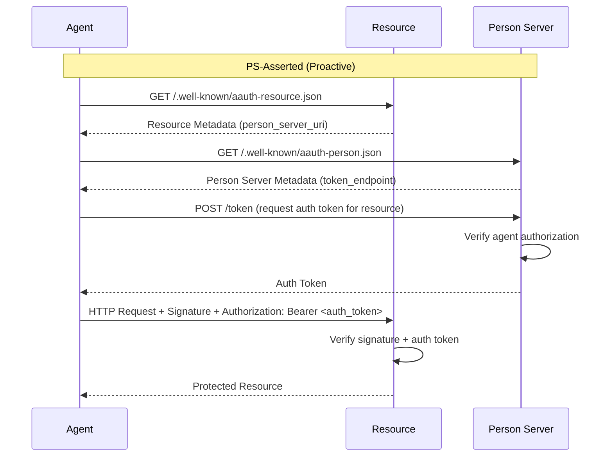
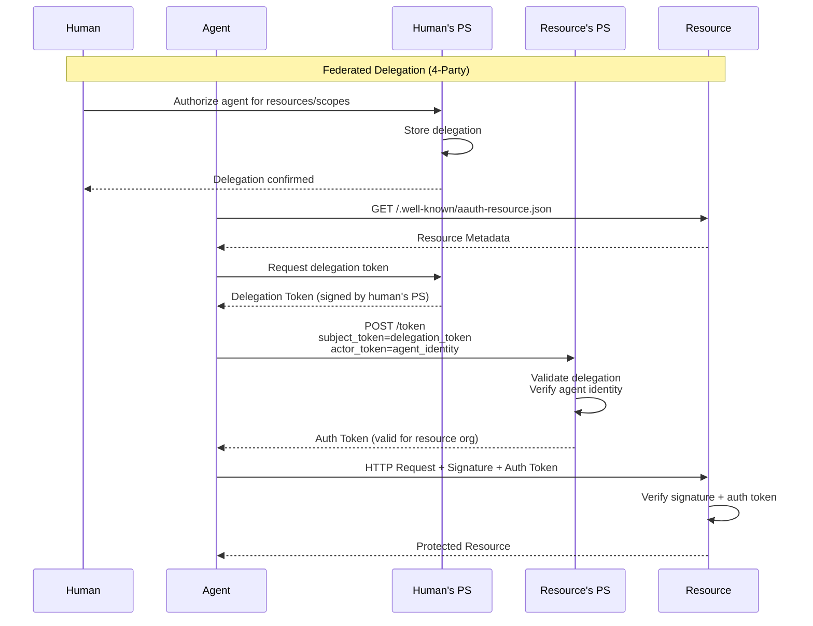
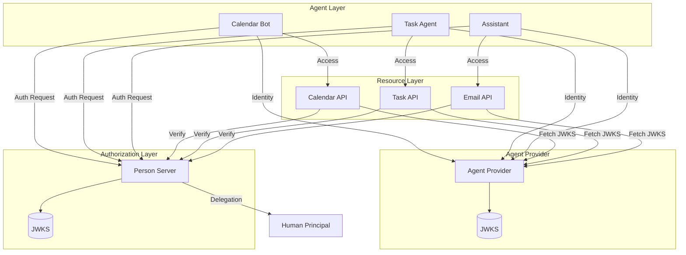
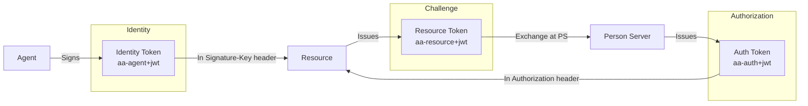

# AAuth Diagrams

This page provides visual diagrams of the AAuth protocol flows.

## Identity-Only Flow

The simplest flow where resources only verify agent identity.



## Resource-Managed Flow

Resources challenge agents to obtain auth tokens from the Person Server.



## PS-Asserted Flow

Agent proactively obtains auth tokens before accessing resources.



## Federated Delegation Flow

Cross-organizational access with human delegation.



## Component Architecture



## Token Types



## JWT Structure

### Identity Token (aa-agent+jwt)

```json
{
  "header": {
    "alg": "ES256",
    "typ": "aa-agent+jwt",
    "kid": "agent-key-1"
  },
  "payload": {
    "iss": "https://agents.example.com",
    "sub": "aauth:calendar-bot@example.com",
    "aud": ["https://resource.example.com"],
    "iat": 1234567890,
    "exp": 1234571490,
    "cnf": {
      "jwk": { "kty": "EC", "crv": "P-256", ... }
    }
  }
}
```

### Auth Token (aa-auth+jwt)

```json
{
  "header": {
    "alg": "ES256",
    "typ": "aa-auth+jwt",
    "kid": "ps-key-1"
  },
  "payload": {
    "iss": "https://ps.example.com",
    "sub": "aauth:calendar-bot@example.com",
    "aud": ["https://resource.example.com"],
    "scope": "calendar:read calendar:write",
    "iat": 1234567890,
    "exp": 1234571490,
    "cnf": {
      "jkt": "NzbLsXh8uDCcd-6MNwXF4W_7noWXFZAfHkxZsRGC9Xs"
    }
  }
}
```

### Resource Token (aa-resource+jwt)

```json
{
  "header": {
    "alg": "ES256",
    "typ": "aa-resource+jwt",
    "kid": "resource-key-1"
  },
  "payload": {
    "iss": "https://resource.example.com",
    "sub": "aauth:calendar-bot@example.com",
    "aud": ["https://ps.example.com"],
    "scope": "calendar:read",
    "jkt": "NzbLsXh8uDCcd-6MNwXF4W_7noWXFZAfHkxZsRGC9Xs",
    "iat": 1234567890,
    "exp": 1234568190
  }
}
```

## PIDL Protocol Diagrams

Protocol diagrams are also available in PIDL format for generating various output formats:

```bash
# Generate PlantUML
pidl generate aauth/pidl/identity_only.json

# Generate Mermaid
pidl generate -f mermaid aauth/pidl/resource_managed.json

# Generate D2
pidl generate -f d2 aauth/pidl/federated.json
```

Available PIDL files:

- `aauth/pidl/identity_only.json`
- `aauth/pidl/resource_managed.json`
- `aauth/pidl/ps_asserted.json`
- `aauth/pidl/federated.json`
