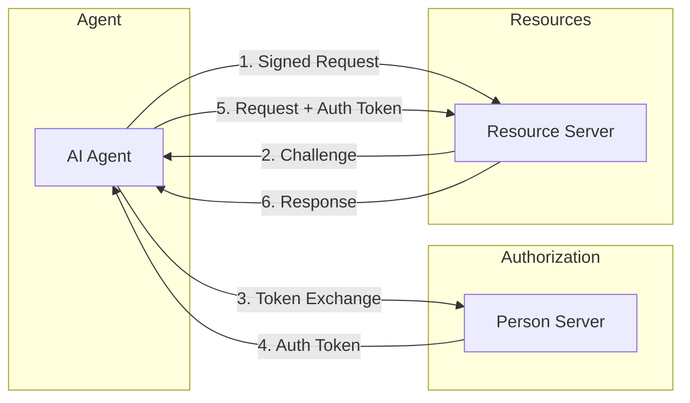
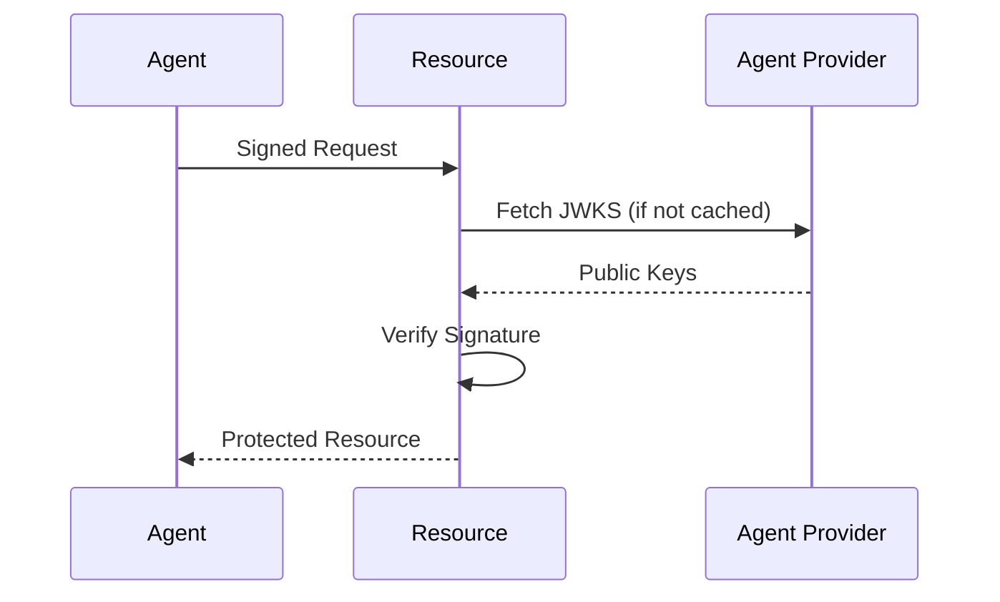
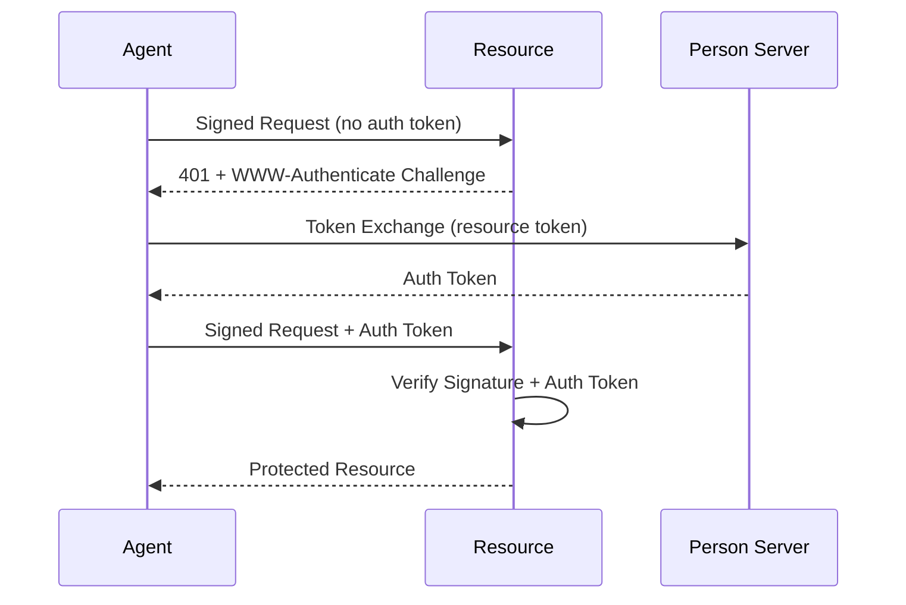
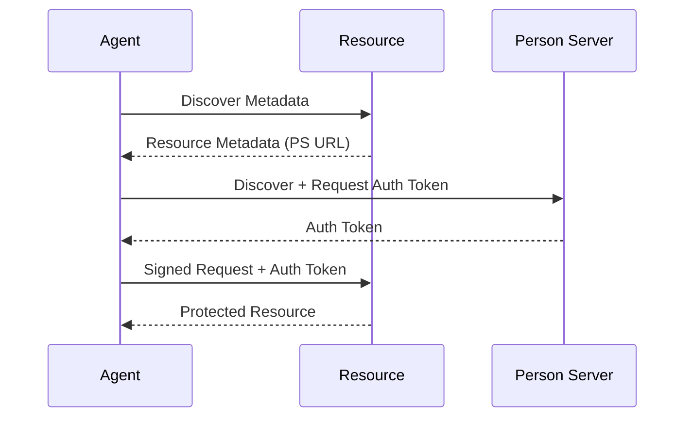
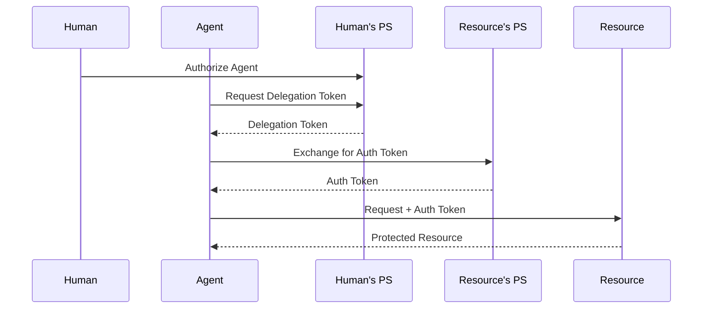

# AAuth Overview

AAuth (Agent Auth) is a protocol for AI agent authentication based on [draft-hardt-oauth-aauth-protocol](https://datatracker.ietf.org/doc/draft-hardt-oauth-aauth-protocol/).

!!! warning "Experimental"
    This package implements a draft specification that is subject to change.

## What is AAuth?

AAuth provides a standardized approach to agent authentication using cryptographic identity, HTTP message signatures (RFC 9421), and OAuth 2.0 token exchange (RFC 8693).



## Key Concepts

### AAuth ID

The canonical identifier format for agents:

```
aauth:local@domain
```

Examples:

- `aauth:calendar-bot@example.com`
- `aauth:task-agent@corp.example.com`
- `aauth:assistant@agents.provider.com`

### Identity Token (aa-agent+jwt)

A JWT asserting the agent's identity, used as the `Signature-Key` header:

```json
{
  "iss": "https://agents.example.com",
  "sub": "aauth:calendar-bot@example.com",
  "aud": ["https://resource.example.com"],
  "exp": 1234567890,
  "cnf": { "jwk": { "kty": "EC", ... } }
}
```

### Auth Token (aa-auth+jwt)

A JWT issued by the Person Server authorizing the agent:

```json
{
  "iss": "https://ps.example.com",
  "sub": "aauth:calendar-bot@example.com",
  "aud": ["https://resource.example.com"],
  "scope": "calendar:read calendar:write",
  "cnf": { "jkt": "abc123..." }
}
```

The `cnf` claim binds the token to the agent's key via JWK Thumbprint (RFC 7638).

### Resource Token (aa-resource+jwt)

A JWT issued by resources in challenges:

```json
{
  "iss": "https://resource.example.com",
  "sub": "aauth:calendar-bot@example.com",
  "aud": ["https://ps.example.com"],
  "scope": "calendar:read",
  "jkt": "abc123..."
}
```

## Authentication Flows

AAuth supports multiple authentication flows depending on security requirements:

### Identity-Only Flow (2-Party)

For resources that only need to verify agent identity:



**Use when:**

- Resource trusts any authenticated agent
- No fine-grained authorization needed
- Simpler deployment desired

### Resource-Managed Flow (3-Party)

For resources requiring Person Server authorization:



**Use when:**

- Resources need human authorization verification
- Scope-based access control required
- Multiple authorization levels needed

### PS-Asserted Flow (3-Party, Proactive)

For agents that obtain tokens before accessing resources:



**Use when:**

- Agent knows required scopes in advance
- Pre-flight authorization preferred
- Caching auth tokens across requests

### Federated Flow (4-Party)

For cross-organizational access with delegation:



**Use when:**

- Cross-organizational access needed
- Agent and resource in different trust domains
- Explicit human delegation required

## Protocol Components

| Component | Description |
|-----------|-------------|
| **Agent** | AI agent with cryptographic identity |
| **Agent Provider** | Issues and manages agent identities, publishes JWKS |
| **Person Server** | Authorization server issuing auth tokens on behalf of humans |
| **Resource Server** | Hosts protected resources, verifies agent identity and authorization |

## Key Standards

| Standard | Purpose |
|----------|---------|
| [RFC 9421](https://www.rfc-editor.org/rfc/rfc9421) | HTTP Message Signatures |
| [RFC 8693](https://www.rfc-editor.org/rfc/rfc8693) | OAuth 2.0 Token Exchange |
| [RFC 7800](https://www.rfc-editor.org/rfc/rfc7800) | Proof-of-Possession Key (cnf claim) |
| [RFC 7638](https://www.rfc-editor.org/rfc/rfc7638) | JWK Thumbprint |
| [RFC 7517](https://www.rfc-editor.org/rfc/rfc7517) | JSON Web Key (JWK) |

## AAuth vs ID-JAG vs AIMS

| Aspect | AAuth | ID-JAG | AIMS |
|--------|-------|--------|------|
| **Type** | Protocol | Protocol | Framework |
| **Identity Model** | AAuth IDs | OAuth assertions | SPIFFE IDs |
| **Credential Format** | aa-agent+jwt, aa-auth+jwt | JWT assertions | X.509 SVIDs, WITs |
| **Authentication** | HTTP signatures + tokens | Token exchange | mTLS or WIT/WPT |
| **Delegation** | Person Server + cnf | `act` claim | SPIFFE conventions |
| **Standards** | RFC 9421, RFC 8693 | RFC 8693, RFC 7523 | SPIFFE, WIMSE |

## References

- [draft-hardt-oauth-aauth-protocol](https://datatracker.ietf.org/doc/draft-hardt-oauth-aauth-protocol/)
- [RFC 9421 - HTTP Message Signatures](https://www.rfc-editor.org/rfc/rfc9421)
- [RFC 8693 - OAuth 2.0 Token Exchange](https://www.rfc-editor.org/rfc/rfc8693)
- [RFC 7800 - Proof-of-Possession Key Semantics](https://www.rfc-editor.org/rfc/rfc7800)
