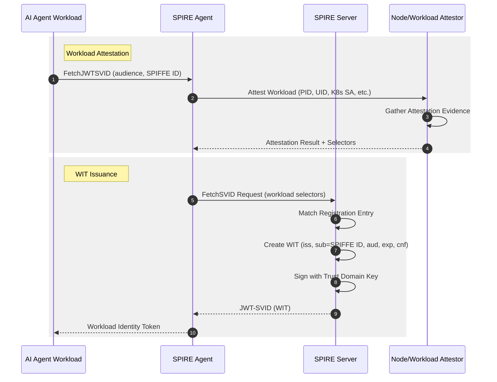
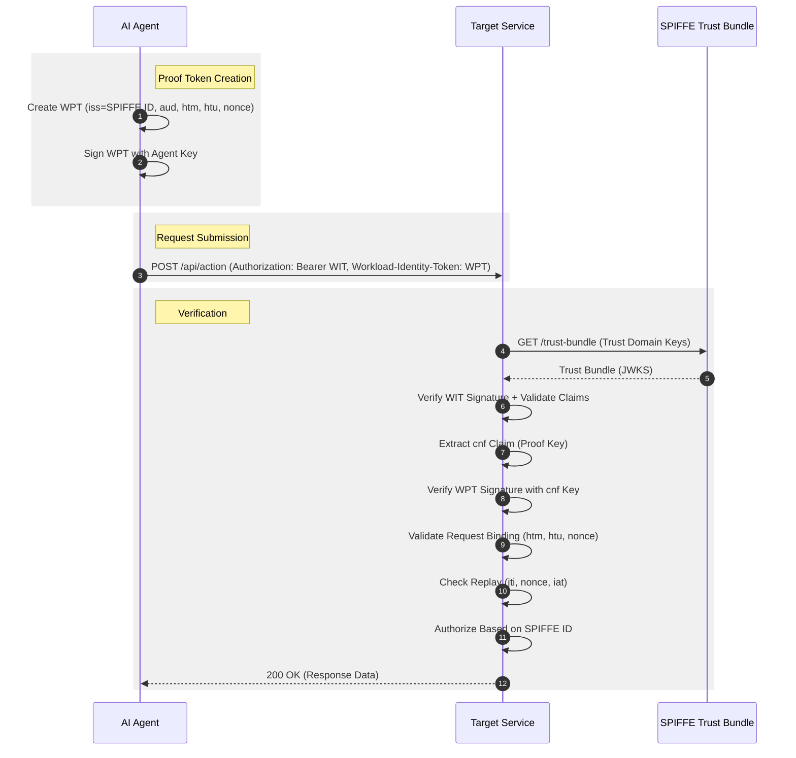
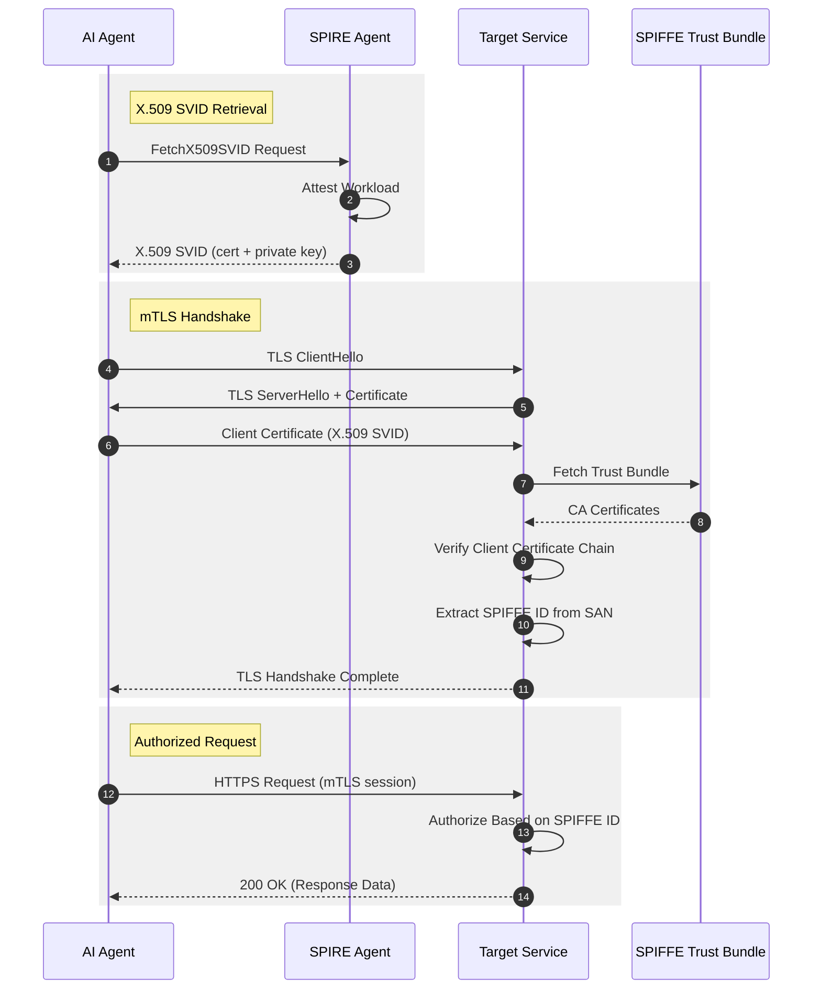
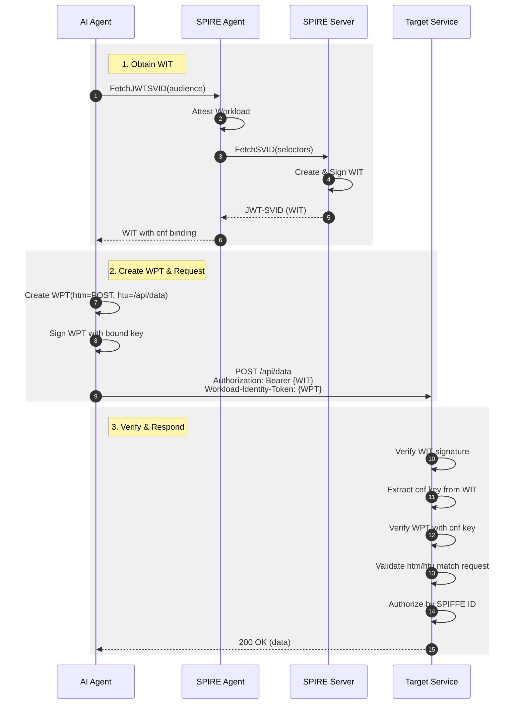

# Protocol Diagrams

These sequence diagrams are generated from [PIDL](https://github.com/grokify/pidl) protocol definitions.

## WIT Issuance Flow

The Workload Identity Token (WIT) issuance flow shows how an AI agent workload obtains a WIT credential through SPIRE workload attestation.



**PIDL Source:** [`aims_wit_flow.json`](https://github.com/aistandardsio/agent-protocols/blob/main/aims/pidl/aims_wit_flow.json)

---

## WPT Authentication Flow

The WIMSE Proof Token (WPT) authentication flow shows how an agent uses its WIT and a request-bound WPT to authenticate to a target service.



**PIDL Source:** [`aims_wpt_flow.json`](https://github.com/aistandardsio/agent-protocols/blob/main/aims/pidl/aims_wpt_flow.json)

---

## mTLS Authentication Flow

For X.509 SVID-based authentication, agents use mutual TLS directly without separate proof tokens.



---

## Combined Flow: WIT + WPT End-to-End

This diagram shows the complete flow from workload attestation through authenticated API access.



---

## About PIDL

These diagrams are generated from [PIDL](https://github.com/grokify/pidl) (Protocol Interaction Description Language) definitions. PIDL provides:

- **Single source of truth** - JSON protocol definitions
- **Multiple output formats** - Mermaid, PlantUML, Graphviz DOT, D2
- **Validation** - Schema-based validation of protocol definitions
- **Consistency** - Same structure for all protocols

### Regenerating Diagrams

```bash
# Install PIDL CLI
go install github.com/grokify/pidl/cmd/pidl@latest

# Generate Mermaid diagrams
pidl generate -f mermaid aims/pidl/aims_wit_flow.json
pidl generate -f mermaid aims/pidl/aims_wpt_flow.json
```
