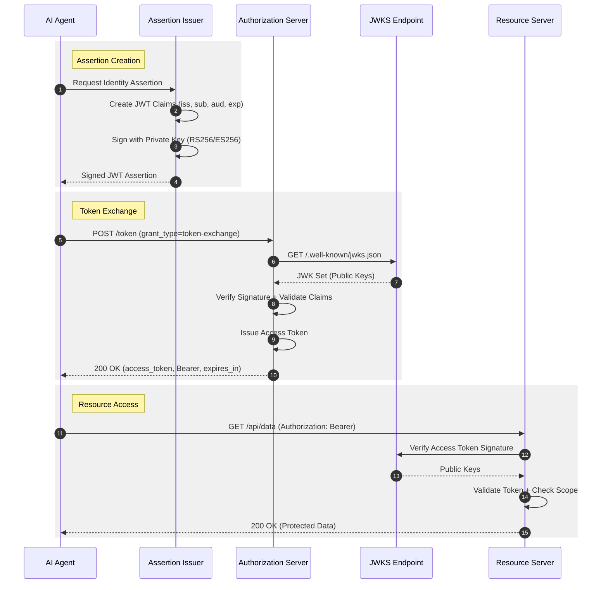
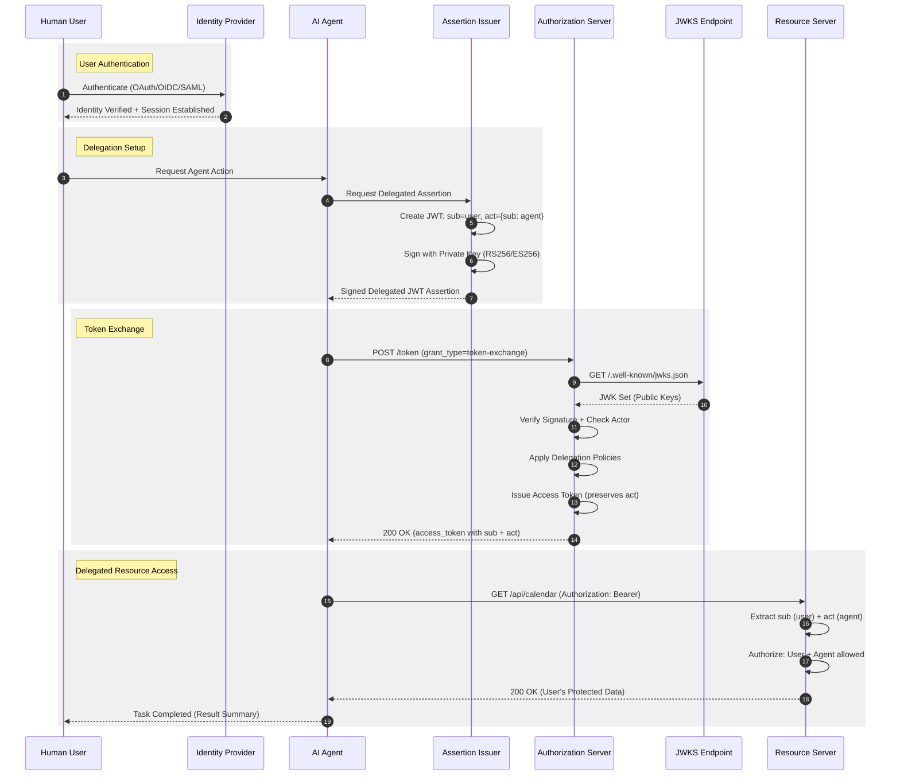

# Diagram Comparison: Mermaid vs D2

This page compares the same ID-JAG flows rendered with two different diagram tools:

- **Mermaid** - Generated from [PIDL](https://github.com/grokify/pidl) protocol definitions
- **D2** - Hand-crafted diagrams with custom styling

## Simple Flow (Agent-Only)

The agent authenticates as itself without human delegation.

### Mermaid (from PIDL)

### D2 (Hand-crafted)

---

## Delegation Flow (Human-to-Agent)

The agent acts on behalf of a human user using the `act` claim.

### Mermaid (from PIDL)

### D2 (Hand-crafted)

---

## Token Exchange Sequence (D2 Only)

A detailed view of the token exchange process:

---

## Comparison Summary

| Aspect | Mermaid (PIDL) | D2 |
|--------|----------------|-----|
| **Source** | Generated from JSON protocol definition | Hand-crafted `.d2` files |
| **Maintainability** | Single source of truth (PIDL JSON) | Manual updates required |
| **Styling** | Limited, theme-based | Full control over colors, shapes |
| **Web Embedding** | Native in MkDocs, GitHub | Requires SVG rendering |
| **Tooling** | `pidl generate -f mermaid` | `d2 file.d2 file.svg` |
| **Best For** | Quick iteration, consistency | Polished documentation |

## Source Files

### PIDL Definitions

- [`idjag_simple.json`](https://github.com/grokify/agent-protocols/blob/main/idjag/pidl/idjag_simple.json)
- [`idjag_delegation.json`](https://github.com/grokify/agent-protocols/blob/main/idjag/pidl/idjag_delegation.json)

### D2 Source Files

- [`simple-flow.d2`](https://github.com/grokify/agent-protocols/blob/main/docs/idjag/diagrams/simple-flow.d2)
- [`delegation-flow.d2`](https://github.com/grokify/agent-protocols/blob/main/docs/idjag/diagrams/delegation-flow.d2)
- [`token-exchange-sequence.d2`](https://github.com/grokify/agent-protocols/blob/main/docs/idjag/diagrams/token-exchange-sequence.d2)
