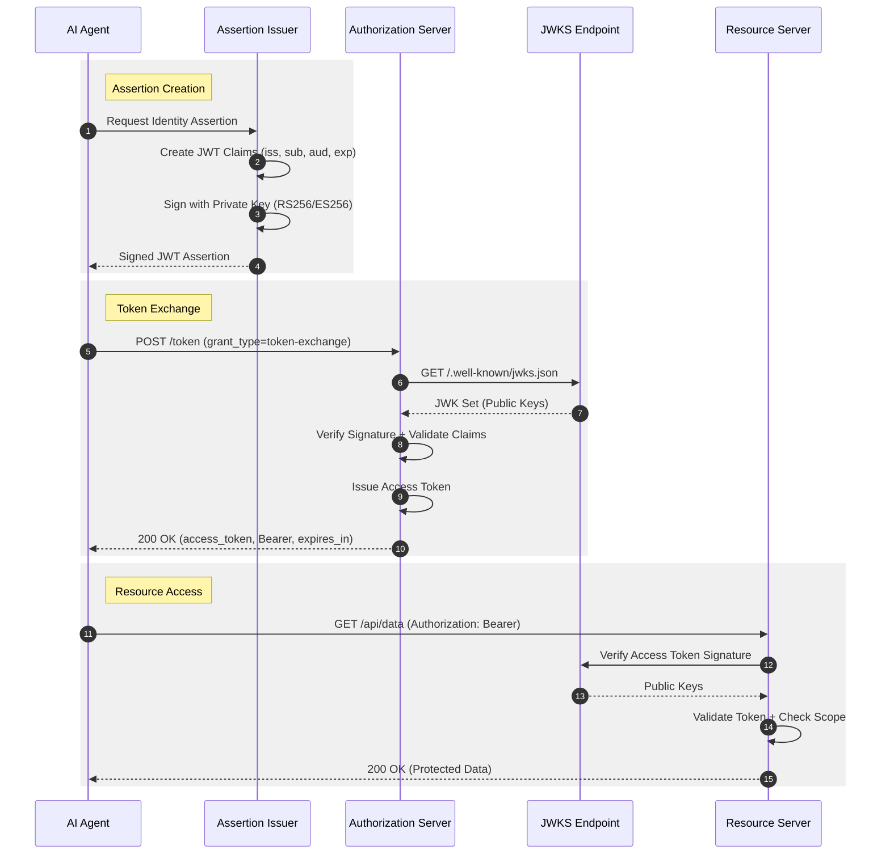
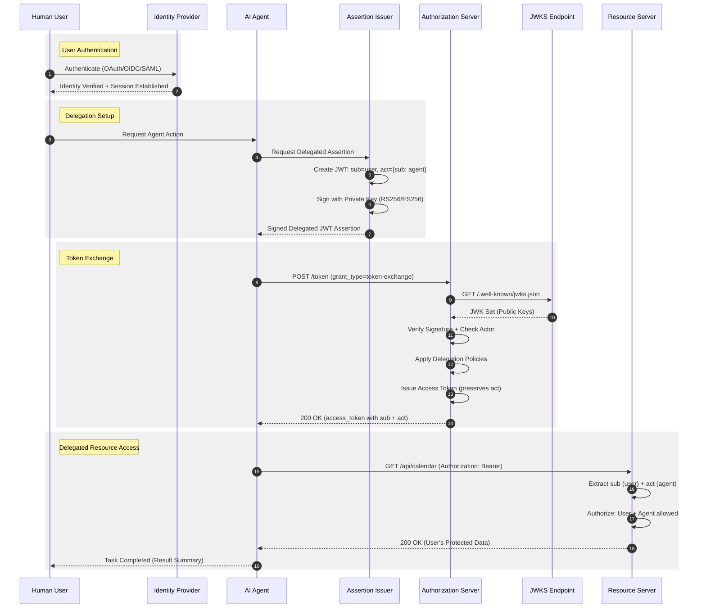
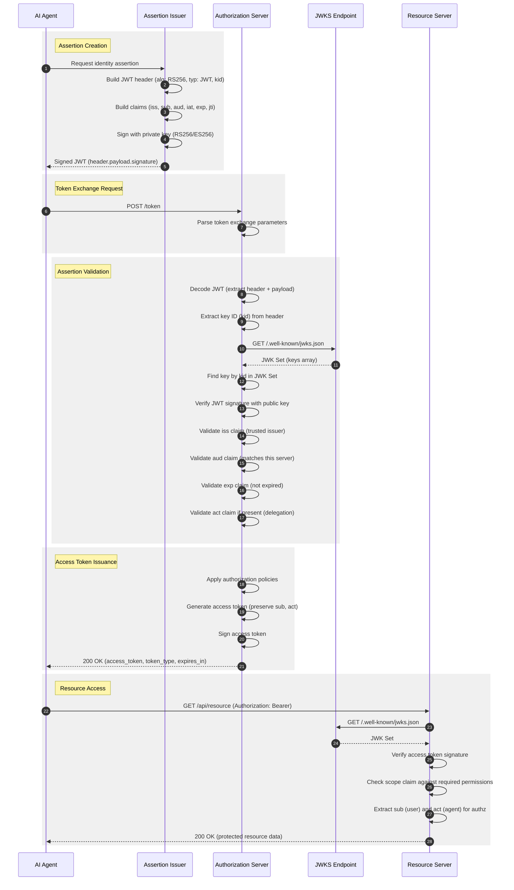

# Protocol Diagrams

These sequence diagrams are generated from [PIDL](https://github.com/grokify/pidl) protocol definitions.

## Simple Flow (Agent-Only)

The agent authenticates as itself without human delegation.



**PIDL Source:** [`idjag_simple.json`](https://github.com/grokify/agent-protocols/blob/main/idjag/pidl/idjag_simple.json)

---

## Delegation Flow (Human-to-Agent)

The agent acts on behalf of a human user using the `act` claim.



**PIDL Source:** [`idjag_delegation.json`](https://github.com/grokify/agent-protocols/blob/main/idjag/pidl/idjag_delegation.json)

---

## Token Exchange Sequence (Detailed)

A detailed view of the complete token exchange process including JWT construction, signature verification, and claim validation.



**PIDL Source:** [`idjag_token_exchange.json`](https://github.com/grokify/agent-protocols/blob/main/idjag/pidl/idjag_token_exchange.json)

---

## About PIDL

These diagrams are generated from [PIDL](https://github.com/grokify/pidl) (Protocol Interaction Description Language) definitions. PIDL provides:

- **Single source of truth** - JSON protocol definitions
- **Multiple output formats** - Mermaid, PlantUML, Graphviz DOT, D2
- **Validation** - Schema-based validation of protocol definitions
- **Consistency** - Same structure for all protocols

### Regenerating Diagrams

```bash
# Install PIDL CLI
go install github.com/grokify/pidl/cmd/pidl@latest

# Generate Mermaid diagrams
pidl generate -f mermaid idjag/pidl/idjag_simple.json
pidl generate -f mermaid idjag/pidl/idjag_delegation.json
pidl generate -f mermaid idjag/pidl/idjag_token_exchange.json
```
