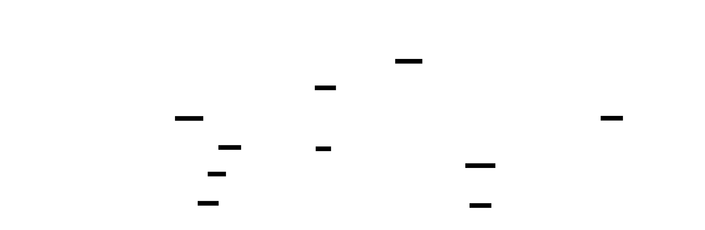

# agent-protocols

Go implementation of agent-to-agent communication protocols.

!!! warning "Experimental"
    This library implements draft specifications that are subject to change.

## Overview

This repository provides Go libraries for emerging agent-to-agent protocols, starting with **ID-JAG** (Identity Assertion JWT Authorization Grant).



## What is ID-JAG?

ID-JAG enables secure token exchange where an agent presents a signed JWT assertion to obtain an access token. It solves key challenges in agent authentication:

| Challenge | ID-JAG Solution |
|-----------|-----------------|
| Agent needs its own identity | Agents authenticate with their own credentials |
| Agent acts on behalf of human | Delegation via `act` claim preserves human identity |
| Multi-agent workflows | Nested delegation chains track full authorization path |
| Audit requirements | Both user and actor identities available for logging |

## Two Authentication Modes

### Simple Mode (Agent-Only)

The agent authenticates as itself without human delegation:

```json
{
  "iss": "https://issuer.example.com",
  "sub": "agent:calendar-bot",
  "aud": "https://auth.example.com"
}
```

### Delegation Mode (Human-to-Agent)

The agent acts on behalf of a human user:

```json
{
  "iss": "https://issuer.example.com",
  "sub": "user:alice",
  "act": {
    "sub": "agent:calendar-bot"
  }
}
```

## Quick Start

```bash
go get github.com/grokify/agent-protocols
```

```go
package main

import (
    "time"
    "github.com/grokify/agent-protocols/idjag"
)

func main() {
    // Simple: Agent authenticates as itself
    assertion := idjag.NewAssertion(
        "https://issuer.example.com",
        "agent:my-agent",
        []string{"https://auth.example.com"},
        5 * time.Minute,
    )

    // Delegation: Agent acts on behalf of user
    delegated := idjag.NewDelegatedAssertion(
        "https://issuer.example.com",
        "user:alice",           // Human user
        "agent:calendar-bot",   // Acting agent
        []string{"https://auth.example.com"},
        5 * time.Minute,
    )
}
```

## Features

| Feature | Description |
|---------|-------------|
| **Assertion Creation** | Build and sign ID-JAG assertions |
| **Token Exchange** | Exchange assertions for access tokens |
| **JWT Verification** | Verify assertions and access tokens |
| **JWKS Support** | Fetch and cache public keys from JWKS endpoints |
| **Server Components** | Ready-to-use authorization and resource server handlers |
| **Delegation Chains** | Support for nested delegation (`act` claim) |

## Documentation

### ID-JAG

- [Getting Started](idjag/getting-started.md) - Installation and first steps
- [Protocol Overview](idjag/protocol-overview.md) - How ID-JAG works with diagrams
- [Examples](idjag/examples.md) - Running the demo applications
- [API Reference](idjag/api-reference.md) - Complete Go package documentation

## Related Specifications

- [draft-ietf-oauth-identity-assertion-authz-grant](https://datatracker.ietf.org/doc/draft-ietf-oauth-identity-assertion-authz-grant/)
- [RFC 8693 - OAuth 2.0 Token Exchange](https://tools.ietf.org/html/rfc8693)
- [RFC 7519 - JSON Web Token](https://tools.ietf.org/html/rfc7519)
- [RFC 7523 - JWT Bearer Assertion](https://tools.ietf.org/html/rfc7523)
